<!-- Bannière : le fichier banner.svg doit être à la racine de ce dépôt -->
<p align="center">
  <a href="https://kck-it.fr"></a>
</p>

<p align="center">
  
</p>

<p align="center">
  <a href="https://kck-it.fr"></a>
  <a href="mailto:kck-it.contact@kck-it.fr"></a>
  
</p>

<p align="center">
  
</p>

<br />

## 👨‍💻 À propos

```console
snoyy@kck-it:~$ cat a-propos.txt
Étudiant en BTS SIO option SISR à Ensitech, à Cergy.
J'apprends à installer, configurer, sécuriser et maintenir une infrastructure.
À côté, je fais tourner KCK-IT : dépannage de PC, Montage PC , Entretien...
J'aime comprendre comment tout fonctionne, du câble jusqu'au serveur.

snoyy@kck-it:~$ ls competences/
administration-systeme  reseaux  virtualisation  securite  web
```

| | |
|:--|:--|
| 🎓 **Formation** | BTS SIO, option SISR |
| 🏫 **École** | Ensitech, Cergy |
| 🛠️ **Activité** | [KCK-IT](https://kck-it.fr) : réparation informatique |
| 📫 **Contact** | [kck-it.contact@kck-it.fr](mailto:kck-it.contact@kck-it.fr) |

<br />

## 🚀 Mes projets

<table>
  <tr>
    <td width="33%" valign="top">
      <h3>🌐 <a href="https://kck-it.fr">kck-it.fr</a></h3>
      Le site de mon activité de dépannage : prestations, tarifs et formulaire de demande d'intervention.
      <br /><br />
      
      
      
      <br /><sub>Dépôt privé</sub>
    </td>
    <td width="33%" valign="top">
      <h3>🧰 KCK-IT Desk</h3>
      L'outil qui fait tourner mon atelier : demandes, planning à la semaine, fiches d'intervention signées en PDF, rappels automatiques et page de suivi en ligne pour les clients.
      <br /><br />
      
      
      
      <br /><sub>Dépôt privé</sub>
    </td>
    <td width="33%" valign="top">
      <h3>✅ KCK Tâches</h3>
      Une appli de tâches à partager entre amis : listes, calendrier, habitudes, statistiques et notifications.
      <br /><br />
      
      
      
      
      <br /><sub>Dépôt privé</sub>
    </td>
  </tr>
</table>

<br />

## 🖧 Ce que je travaille en BTS SISR

<p align="left">
  
  
  
  
  
  
  
</p>

## 🛠️ Mes outils

**Systèmes et ligne de commande**

<p align="left">
  
</p>

**Développement et hébergement**

<p align="left">
  
</p>

<br />

## 🎯 Objectifs

- [x] Intégrer le BTS SIO option SISR à Ensitech
- [x] Créer mon GitHub et prendre Git en main
- [x] Créer KCK-IT Desk, l'outil de gestion de mon atelier
- [x] Mettre en ligne la première version de **kck-it.fr**
- [x] Monter mon propre lab réseau (serveurs, VM, pare-feu)
- [ ] Décrocher mon BTS 🎓

<br />

## 📊 Mon activité sur GitHub

<p align="center">
  
  
</p>

<p align="center">
  
</p>

<p align="center">
  
</p>

<!-- Le serpent qui mange les contributions : généré par .github/workflows/snake.yml -->
<p align="center">
  <picture>
    <source media="(prefers-color-scheme: dark)" srcset="https://raw.githubusercontent.com/snoyy-i/snoyy-i/output/github-snake-dark.svg" />
    <source media="(prefers-color-scheme: light)" srcset="https://raw.githubusercontent.com/snoyy-i/snoyy-i/output/github-snake.svg" />
    
  </picture>
</p>

<br />

## 📫 Me contacter

**Un projet, une question, une panne ?** Écris-moi, je réponds vite.

<p align="left">
  <a href="mailto:kck-it.contact@kck-it.fr"></a>
  <a href="https://kck-it.fr"></a>
</p>

<p align="center">
  
</p>
